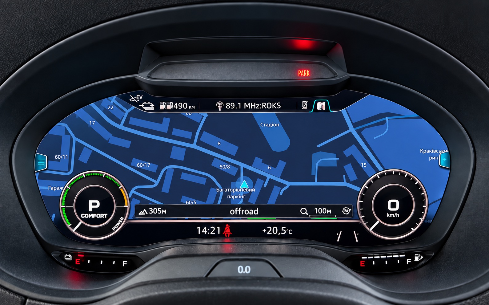

# MHI2 AU37x CarPlay patches

CarPlay additions for Audi MHI2 head units on the **`MHI2_ER_AU37x`** train:

- **CarPlay map in the Virtual Cockpit** — the phone's own navigation map (Apple Maps,
  Google Maps, Waze) in the cluster in place of the stock one, 30 fps, decoded by the
  head unit's video hardware. Follows the cluster's large, Sport and Classic views.
- **Route guidance** — CarPlay turn-by-turn maneuvers in the cluster's maneuver tile:
  the arrow, the distance, the street and lane guidance, drawn live in 3D.
- **Cover art** — CarPlay album artwork on the cluster's now-playing widget.
- **Touchpad → D-pad** — the MMI touchpad navigates CarPlay menus.

Prebuilt binaries, installed over a network cable or from an M.I.B. SD card.

> **Use at your own risk.** Everything is reversible, but read
> [Recovery](https://github.com/chefranov/mhi2-au37x-carplay/wiki/Troubleshooting#recovery)
> before you start.

<p align="center"></p>
<p align="center"></p>
<p align="center"></p>
<p align="center"></p>

## Compatibility

Tested on `MHI2_ER_AU37x_P5089`, `MU1326`, part `8V1035036A` — Audi A3 8V with the
Virtual Cockpit and the HARMAN iAP2 stack. Other `MHI2_ER_AU37x_*` builds are expected
to work but are not verified: **[read Compatibility before installing](https://github.com/chefranov/mhi2-au37x-carplay/wiki/Compatibility)**.

- **CarPlay map in the cluster** needs the iPhone **by cable** — wireless CarPlay
  adapters do not pass the cluster stream.
- **Cover art** needs module **17**, adaptation `Picture_Upload_Download` = **active**.
- **Route guidance** works with Apple Maps and Google Maps. Waze sends no turn-by-turn
  data over CarPlay; its map still shows in the cluster.
- **D-pad** is self-contained: `bin/dpad_hook.jar` alone in `/mnt/app/eso/hmi/lsd/jars/`.

## Install

Over a network cable:

```sh
ssh root@172.16.250.248 'mount -uw /mnt/app; mkdir -p /mnt/app/root/carplay'
scp -O -r bin install.sh uninstall.sh root@172.16.250.248:/mnt/app/root/carplay/
ssh root@172.16.250.248 'sh /mnt/app/root/carplay/install.sh'
```

From an M.I.B. SD card: `custom.sh` at `/mod/custom.sh`, the rest of the repository at
`/mod/carplay/`, then `Advanced Settings → Run Custom Script`.

Reboot afterwards. Running the installer again upgrades in place.

| Leave out | Cable | SD card (empty file next to `install.sh`) |
|---|---|---|
| route guidance and the cluster map | `RGI=0 sh install.sh` | `NO_RGI` |
| only the cluster map | `ALTSCREEN=0 sh install.sh` | `NO_ALTSCREEN` |

Step by step, and what gets changed on the unit:
**[Installation](https://github.com/chefranov/mhi2-au37x-carplay/wiki/Installation)**.

## Using it

- **Cluster map**: comes up with the phone, after a short intro. A **long press of the
  left steering-wheel roller** swaps between the CarPlay map and the stock one; the
  choice survives the ignition.
- **Route guidance**: start a route on the phone. Off without uninstalling:
  `touch /mnt/app/rgd_disable` and reboot; delete the file to turn it back on.
- **Sport layout** is detected by itself. To force it: `touch /mnt/app/rgd_sport`
  (`SPORT=1` / an empty `SPORT` file at install time).

Something not right: **[Troubleshooting](https://github.com/chefranov/mhi2-au37x-carplay/wiki/Troubleshooting)**.

## Uninstall

```sh
ssh root@172.16.250.248 'sh /mnt/app/root/carplay/uninstall.sh'
```

or an empty `/mod/carplay/UNINSTALL` on the card and the custom script again. Reboot.

## Credits

- [luka-dev/mib2q-carplay-rgi](https://github.com/luka-dev/mib2q-carplay-rgi) — the HMI
  patch pattern, the cover-art pipeline, the route-guidance BAP work and the maneuver
  renderer, here ported to the HARMAN iAP2 stack.
- [Mich795](https://github.com/Mich795) — cover-art fixes from a version of their own.
- [aberbic](https://github.com/aberbic/Audi-MHI2-Virtual-Cockpit-Altscreen-CarPlay-AndroidAuto)
  — the hardware-decoder layer setup that lit the cluster map.
